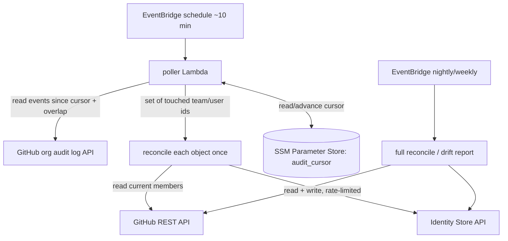

# moj-terraform-scim-github v2 — Architecture & Migration Plan

> Status: **Draft for review** · Language: **Python** · IaC: **Terraform**
>
> A rewrite of [`ministryofjustice/moj-terraform-scim-github`](https://github.com/ministryofjustice/moj-terraform-scim-github)
> to fix GitHub + Identity Store throttling and the 15-minute Lambda wall. **No code yet** —
> this is the plan we agree before building.

---

## 1. Problem statement

The current v1 is a single Node.js Lambda triggered by EventBridge every 6 hours. Each run
does a **full GitHub → AWS IAM Identity Center reconciliation**: scrape the whole org via
nested GraphQL, list every Identity Store group's memberships, diff and mutate everything in
one process.

Symptoms:

- **GitHub API throttling** during discovery (primary/secondary limits, GraphQL node/timeout limits).
- **Identity Store throttling** during writes (~20 TPS per API per store), worsened by fire-and-forget bursts.
- Proper backoff pushes a single run **past the 900s / 15-minute Lambda hard limit**.
- Timeout is 300s, duration alarm at 270s — no headroom.

**Root cause is the unit of work: "the whole organisation, every run."** Fix that and all
three symptoms go away.

### Guiding principles

> 1. **Work on deltas, not the whole org.** Only touch what changed.
> 2. **Reconcile current state, never replay the delta.** A change signal just means
>    "this team is worth looking at" — we then read GitHub's live truth and converge.
> 3. **Earn every piece of complexity.** Each component must map to an observed problem or
>    cost, not a hypothetical one. Start minimal; graduate only when a number says so.

Principle 2 is what makes ordering, duplicate, and replayed signals a non-issue:
re-reconciling a team is idempotent and converges to the same state.

---

## 2. The complexity ladder (do the cheapest thing that works)

We deliberately frame this as tiers, cheapest first. **Stop as soon as the symptoms are gone.**

| Tier | Change | New infra | Kills 15m wall? | When to stop here |
|------|--------|-----------|-----------------|-------------------|
| **0** | Fix bursting in the existing Lambda: `await` writes, client-side rate limiter, skip unchanged teams via a stored membership hash. | None | Maybe (if most teams are unchanged) | If runtime drops comfortably under 15m. |
| **1** | Move the same logic to a **scheduled ECS/Fargate task**. No time limit; reuse the code. | One task definition | Yes | If you just need the time limit gone and polling-everything is acceptable. |
| **2 (recommended)** | **Audit-log polling**: a scheduled Lambda reads the org audit log, reconciles only the teams/users mentioned. | One SSM parameter (cursor) | Yes | The target design — see §3. |
| **3** | Add SQS + worker fan-out, or webhooks. | Queue / API Gateway ingress | Yes | Only if a single poll's burst threatens the timeout, or you need sub-poll latency. |

**Recommendation:** ship **Tier 0** first and measure. If still over budget, go to **Tier 2**
(audit-log polling) — it removes the wall *and* the throttling by working on deltas, with far
less machinery than webhooks and **no public ingress**.

---

## 3. Target design — audit-log polling (Tier 2)

### Why polling over webhooks

Webhooks need **public inbound ingress** (API Gateway / Lambda URL, signature verification,
WAF, an internet-facing attack surface) — a lot to own for an internal MoJ identity job.
Audit-log polling inverts this: the sync stays **outbound-only**, nothing listens on the
internet, and we still act on **deltas, not full-org scans**.

The cost is latency: audit-log entries can lag by minutes. With a **30-minute worst-case SLA**
and a **10-minute poll**, that's ample headroom.



### Poll cycle

1. Read the cursor (high-water mark) from SSM Parameter Store.
2. Fetch audit-log events since `cursor − overlap` (generous overlap, e.g. last hour) filtered to relevant actions.
3. Collapse events to the **set of team/user ids mentioned** — *any* mention makes an object a reconcile target.
4. Reconcile each touched object **once**, current-state diff (read GitHub truth → diff Identity Store → converge).
5. On success, advance the cursor to the newest processed event.

### Audit-log actions we care about

| Action(s) | Reconcile |
|-----------|-----------|
| `team.add_member`, `team.remove_member` | that team's membership |
| `team.create`, `team.rename` | that slug's group (create if missing) |
| `team.destroy` | poller skips; nightly reconciler removes the orphaned group |
| `org.add_member`, `org.remove_member` | that user (provision / guarded cleanup) |

### Ordering, duplicates, dedup — why this is simple

- **Out-of-order is a non-issue.** We reconcile current state, so it doesn't matter which
  order events arrive in — by the time we process any trigger for a team, GitHub already
  reflects the final state and we converge to it.
- **Renames are treated as identity changes, by design.** The mapping keys on the team **slug**
  (== group `DisplayName`), the same key access is managed on (see §6). A rename `x → y` reads as
  "new slug `y` (create its group), old slug `x` gone (reconciler cleans up)" — which is exactly
  the behaviour the access process expects. We do **not** follow renames via the team id.
- **`destroy`** needs no special handling in the poller: the team is gone, so it is skipped, and
  the nightly reconciler removes the now-orphaned group.
- **No dedup/state table — in fact, no DynamoDB at all.** We considered a 24h TTL table of
  processed event ids and a per-team "already reconciled" table; **both were dropped** because
  idempotent convergence makes a re-seen event a harmless no-op (a few reads, empty diff, zero
  writes). The only state we *need* is the cursor — a single value, so it lives in **SSM
  Parameter Store**, not a table. The GitHub-team → Identity-Store-group mapping is stamped on
  the group itself (§6), so there's no mapping table to drift out of sync with Identity Store.
- **Per-poll coalescing** (the set of touched ids) means a noisy team = one reconcile per poll.

### Inline first, queue only if needed

At a 10-minute poll with per-team coalescing, the poller can reconcile changed objects
**inline** within one invocation. A queue (Tier 3) is only justified if a single poll ever
surfaces a burst large enough to threaten the timeout (e.g. an org-wide change). Start inline;
add SQS fan-out only when a measurement demands it.

### The safety net stays

Keep a **nightly/weekly full reconcile** (now cheap — it can skip unchanged teams via a
membership hash). It catches anything the audit log misses, lags on, or any drift introduced
outside GitHub. Polling drives freshness; this proves correctness.

### Lifecycle ownership (poller vs reconciler) — decided

New teams are onboarded to AWS continuously and **cannot wait** for the nightly run, so the
**poller owns the creation path and runs it immediately**; deletion is rare, destructive, and
safe to defer, so it is the **reconciler's** job.

| Operation | Owner | When | Rationale |
|-----------|-------|------|-----------|
| Create group for a new team | **Poller** | Immediately (next poll) | New groups are onboarded all the time; 12h lag is unacceptable. |
| Add / remove members | **Poller** | Immediately (next poll) | Frequent churn — the poller's whole reason to exist. |
| **Delete empty groups** | **Reconciler** | Nightly | Rare + destructive; only ever fired from whole-state reconciliation, never one delta event. |
| **Remove orphaned users** | **Reconciler** | Nightly | Same: guarded, reviewable, off-peak — never reactive. |

So the poller's write surface is **create group + add/remove member** only. Every destructive
verb lives in the scheduled reconciler, which reads full current state before acting.


---

## 4. Prerequisite spike (do this first — it's make-or-break)

The org audit-log API requires **GitHub Enterprise Cloud** and org-owner-level read access
(`read:audit_log` / appropriate org permission for the App/token). **Verify the App can
actually read `GET /orgs/{org}/audit-log`** before committing to Tier 2. If it can't, fall
back to Tier 1 (Fargate full-delta scan) or Tier 3 (webhooks).

---

## 5. Why Python (and the library choices)

| Concern | Choice | Notes |
|---------|--------|-------|
| Runtime | **Python 3.13** Lambda | |
| AWS SDK | **boto3** (`identitystore`, `dynamodb`) | |
| GitHub API | **REST via `httpx`** | Audit log + per-team member reads; simple, paginated, retryable. |
| GitHub App auth | `PyJWT` + cached installation token | Cache across warm invocations; refresh before expiry. |
| Retries/backoff | **`tenacity`** (exponential + jitter) | Respect `Retry-After` / `x-ratelimit-reset`; cap attempts. |
| Client-side rate limit | small **token bucket** | Hard ceiling below Identity Store's ~20 TPS. |
| Observability | **AWS Lambda Powertools** | Structured `Logger`, `Tracer`, `Metrics` (EMF). |
| Payload parsing | Pydantic models | Validate audit-log entries we depend on. |
| Packaging | `uv`; zip via Terraform `archive_file` (manylinux wheels) or container image | Decide in §9. |
| Tests | **pytest**, **moto**, **respx**, audit-log fixtures | |

> Node's `@octokit/plugin-throttling` has no direct Python equal; we implement the same
> behaviour with `tenacity` + a token bucket — small and easy to unit test.

---

## 6. State — no DynamoDB

The design needs only two pieces of durable state, and neither justifies a database:

| State | Where | Why |
|-------|-------|-----|
| Audit-log cursor | **SSM Parameter Store** (one `String` parameter, e.g. `/scim-sync/audit_cursor`) | A single high-water mark (`@timestamp` + `_document_id`). Versioned, free, nothing to provision. |
| GitHub team → Identity Store group mapping | **The team slug == the group `DisplayName`** | The slug is the identity the rest of the access process is keyed on, so we match on it directly. No extra mapping store, nothing to backfill. |

**Identity is the slug, deliberately — renames are not followed.** Access definitions are keyed
on the team slug. If a team is renamed `x → y` and the access files are not updated, the system
*should* treat `y` as a brand-new team (needs its own access definition) and `x` as gone. Slug
matching gives exactly that: the poller creates a group for `y`, and the nightly reconciler later
removes the now-orphaned `x`. Matching on the immutable team `id` (`ExternalId`) was considered
and **rejected** — it would silently carry `x`'s access over to `y`, diverging from how access is
actually managed. (`ExternalId` may still be read for information, but is never used to match.)

GitHub→user mapping is likewise resolved live (Identity Store `UserName` derived from the
GitHub login + `sso_email_suffix`); no table needed.

**`members_hash` skip-unchanged is dropped for now** — it needed somewhere to persist a hash,
and the nightly full reconcile is the off-peak, rate-limited safety net that can afford to be
thorough. Add it back only if the nightly run is *measured* to be too slow.

---


## 7. Throttling, idempotency & safety

**Rate limiting (two layers):**
- Identity Store: token bucket below 20 TPS (start ~10) + `tenacity` retry with full jitter.
  On persistent throttling, stop and let the next poll resume from the cursor.
- GitHub: low concurrency, respect `Retry-After` / `x-ratelimit-reset`; back off hard on secondary limits.

**Idempotency rules (every operation safe to run twice):**

| Operation | Rule |
|-----------|------|
| create group/user | If it already exists, record mapping and succeed. (Group create = poller.) |
| add membership | If already a member, succeed. |
| remove membership | If not a member, succeed. |
| delete group | **Reconciler only.** Only if `managed_by_sync` and the GitHub team no longer exists. |
| delete user | **Reconciler only.** Only if `managed_by_sync` and login is in no managed team (+ safety check). |

**Error handling:** a throttled/failed mutation must **never** look like a successful sync —
fail loudly, leave the cursor un-advanced for the affected window, retry next poll.

---

## 8. Repository layout (proposed)

The repo is **polyglot**: a new **Python poller** (the Tier 2 hot path) plus the **vendored
legacy v1 Node script**, demoted to the nightly/weekly full reconciler (§3). They are
separate deployables that share one contract — the slug mapping convention (§6) —
which lives in `docs/`.

```
moj-terraform-scim-github-v2/
├── docs/
│   ├── architecture-v2.md
│   └── mapping-contract.md          # team slug == group DisplayName: the shared contract
├── poller/                          # NEW — Python, the Tier 2 hot path
│   ├── src/
│   │   └── scim_sync/
│   │       ├── handlers/
│   │       │   └── poller.py        # Lambda entrypoint (audit-log poll → reconcile)
│   │       ├── pipeline.py          # shared poll → build-plans orchestration
│   │       ├── apply.py             # applies plans (gated by NOT_DRY_RUN)
│   │       ├── logic/
│   │       │   ├── audit_events.py  # parse + map audit entries → touched ids
│   │       │   ├── watermark.py     # cursor advance over processed events
│   │       │   ├── diff.py          # pure membership-diff logic
│   │       │   └── plan.py          # build TeamPlan (membership / new group)
│   │       ├── adapters/
│   │       │   ├── github_client.py # httpx (audit log + team members), read-only
│   │       │   ├── identity_store.py# boto3 (read + gated create/add/remove)
│   │       │   ├── cursor_store.py  # SSM Parameter Store get/put watermark
│   │       │   └── watermark_store.py# file-backed cursor (local dry-run stand-in)
│   │       ├── dry_run.py           # local read-only CLI
│   │       └── config.py
│   ├── tests/
│   │   ├── unit/                    # diff, audit-event mapping, watermark, plan, apply
│   │   └── fixtures/audit_log/
│   └── pyproject.toml               # uv / ruff / pytest — scoped to the poller
├── reconciler/                      # legacy v1, vendored ~as-is (Node)
│   └── function/                    # the old script; runs nightly as full reconcile
├── terraform/                       # deploys the poller Lambda (+ reconciler later)
└── README.md
```

### Why this shape

- **Two top-level components** (`poller/`, `reconciler/`) make the lineage and the migration
  obvious: the poller is where new work happens; the reconciler is "old and busted, kept as
  the backstop" and is expected to be retired later. Don't entangle them.
- **`poller/` owns its own `pyproject.toml`** so the Python build/test/lint is scoped and the
  legacy Node tooling doesn't bleed into it (or vice versa).
- **`reconciler/function/`** mirrors v1's existing layout so we can vendor it with minimal
  edits. If it busts the 15-minute wall on a nightly run, Terraform deploys it as a **Fargate
  task** instead of a Lambda — no code change (Tier 1).
- **`docs/mapping-contract.md`** pins the one thing both components must agree on: the GitHub
  team **slug** maps to the Identity Store group **`DisplayName`**. Both components read it the
  same way. This is the seam most likely to cause silent drift, so it's written down.
- **`watermark.py`** is split out because the "advance only over the contiguous processed
  prefix, dedup by `_document_id`, query `created:>= watermark − overlap` ascending" logic is
  pure and deserves its own unit tests.

Handlers stay thin: parse → call a service → return. Business logic lives in `logic/` and is
unit-testable without AWS or GitHub. The pure diff is the testable core:

```python
def diff_memberships(desired_user_ids: set[str], actual_user_ids: set[str], group_id: str):
    return {
        "add":    [{"group_id": group_id, "user_id": u} for u in desired_user_ids - actual_user_ids],
        "remove": [{"group_id": group_id, "user_id": u} for u in actual_user_ids - desired_user_ids],
    }
```

---

## 9. Terraform resources (new)

Deliberately small — no ingress, no queue (until Tier 3):

- `aws_lambda_function.poller` + `aws_cloudwatch_event_rule` (~10 min) + target.
- `aws_lambda_function.full_reconcile` + `aws_cloudwatch_event_rule` (nightly + weekly) + targets.
- `aws_ssm_parameter.audit_cursor` (the single piece of state). **No DynamoDB.**
- IAM scoped least-privilege: Identity Store read/write, read/write the cursor parameter, read the GitHub App secret.
- Secrets: GitHub App private key in SSM Parameter Store / Secrets Manager. **No webhook secret needed.**
- Reuse v1's monitoring: alarms on poller errors/duration, **stale cursor** (cursor not advancing), full-reconcile failure → SNS.

Carry forward useful v1 variables: `github_organisation`, `github_app_id`,
`github_app_installation_id`, `github_app_private_key`, `sso_identity_store_id`,
`sso_email_suffix`, `not_dry_run`, monitoring inputs.

### Open decisions

1. **Packaging** — zip with vendored manylinux wheels, or container image?
2. **Dry-run / shadow mode** — keep v1's `not_dry_run`: compute and *log* the diff, emit a "would change" metric, don't write. Essential for safe cutover.
3. **Repo rename** — README already notes it uses the Identity Store API, not SCIM. Suggest naming the deployable `github-identity-store-sync` to stop confusing people.
4. **Poll interval** — 10 min proposed (SLA 30 min). 5 min is free later if we want lower latency.
5. **Multi-org** — keep v1's one-org-per-deployment constraint?

---

## 10. Migration plan (incremental, low-risk)

Run v2 **alongside** v1; v1 stays the source of truth until v2 is proven.

| Phase | What | Writes? | Exit criteria |
|-------|------|---------|---------------|
| **0. Spike** | Confirm App can read the org audit log (§4). | — | `GET /orgs/{org}/audit-log` returns the actions we need. |
| **1. Tier 0 quick win** | In v1 (or ported logic): `await` writes, rate limiter, skip-unchanged hash. Measure runtime. | n/a | Decide whether Tier 0 alone is enough. |
| **2. Scaffold** | Repo, Terraform skeleton, CI, packaging, observability, pure `diff` + audit-event mapping with unit tests. | — | Poller deploys; mapping + diff unit tests pass. |
| **3. Read-only shadow** | Poller reconciles touched teams in **dry-run**, logs would-be diffs. | No | Proposed diffs match v1's behaviour for the same teams; no false drift. |
| **4. Membership writes** | Enable group **membership** add/remove only. | Membership | Targeted syncs apply; throttling stays clear. |
| **5. Group create (poller)** | Poller creates groups for new teams immediately; rename via team-ID mapping. Deletion stays with the reconciler. | + group create | New teams onboard within one poll; no duplicate/orphan groups on rename. |
| **6. Reconciler deletion** | Nightly reconciler deletes empty groups + removes orphaned users, guarded by `managed_by_sync`. | + deletes | Deletion guardrails verified; only fires from full-state reconcile. |
| **7. Demote then retire v1** | v1 → drift-detector, then decommission once v2 owns steady state. | — | v2 owns sync; runbook + alarms in place. |

---

## 11. What we deliberately avoid

- **Public inbound ingress** (the main reason to prefer polling over webhooks).
- **DynamoDB / any mapping cache** — the cursor lives in SSM and the mapping is stamped on the Identity Store group, so there's no separate store to drift (§6).
- An event-dedup / per-team state table — idempotent convergence makes it unnecessary (§3).
- A queue/fan-out before a measurement shows a single poll's burst threatens the timeout.
- Replaying the audit-log delta instead of reconciling current state.
- GitHub GraphQL as the central discovery mechanism for the hot path.
- Aggressive user deletion on a single event.
- "Logged but carried on" error handling.

---

## 12. Suggested next step

Start with **Phase 0 (audit-log access spike)** and **Phase 1 (Tier 0 quick win + measure)**
in parallel — both are cheap and de-risk everything after. If the spike passes and Tier 0
isn't sufficient alone, proceed to scaffold the poller with the pure `diff` + audit-event
mapping behind dry-run.
